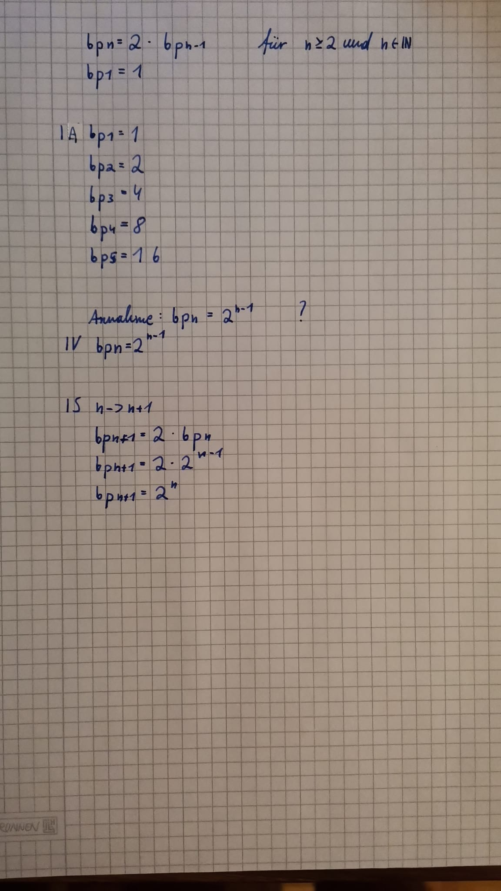
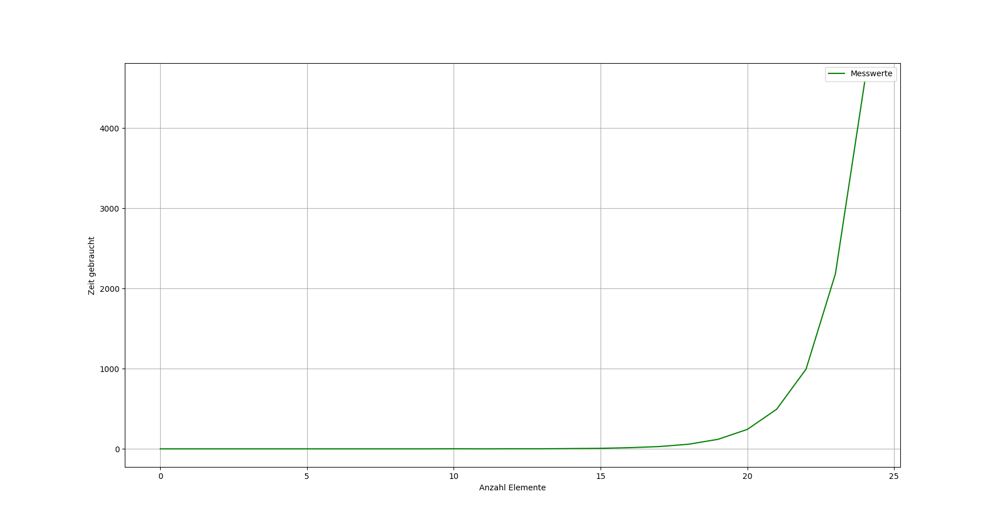
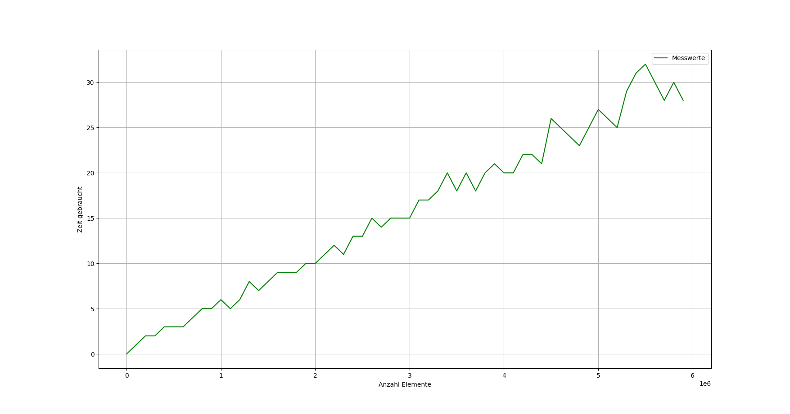

# Allgemeine Build-Anweisungen
Die Programme Rucksack (Aufgabe 1/2) und Reverse (Aufgabe 3) haben je ein eigenes Verzeichnis.
Die Programme können mit make und dem gcc gebaut werden. Jedes Programm hat eine eigene Makefile im zugehörigen Unterverzeichnis.

## Beschreibung der beiden Makefiles
### ./Rucksack/Makefile
|Regel|Beschreibung|
|---|---|
|Rucksack| baut das Programm Rucksack aus den Quell- und Headerdateien|
|run|baut ggf. das Programm, führt das Programm und bei Erfolg anschließend _make clean_ aus|
|check|baut das Programm und räumt anschließend auf => dient zur Prüfung des Codes auf Fehler und Warnungen|
|test| Startet statt der Demo den Laufzeittest. ACHTUNG: vorherige Daten werden überschrieben
|archive|erstellt ein Archiv aus dem aktuellen Verzeichnis|
|clean|löscht alle Objektdateien und das Programm|

### ./Reverse/Makefile
|Regel|Beschreibung|
|---|---|
|Reverse| baut das Programm Reverse aus den Quell- und Headerdateien|
|run|baut ggf. das Programm, führt das Programm und bei Erfolg anschließend _make clean_ aus|
|check|baut das Programm und räumt anschließend auf => dient zur Prüfung des Codes auf Fehler und Warnungen|
|archive|erstellt ein Archiv aus dem aktuellen Verzeichnis|
|clean|löscht alle Objektdateien und das Programm|

## Was tun die Programme?
### Rucksack
Wenn das Programm Rucksack durch _make run_, oder _make_ + _./Rucksack_ ausgeführt wird, wird ein Beispieldatensatz über 8 Objekte mit Backtracking und Greedy verpackt, die Kapazität beträgt 30. Mit dem Kommando _make test_ werden die Laufzeittests wiederholt.

### Reverse String
Wenn das Program _Reverse_ ausgeführt wird, wird der gegebene Test mit dem Palindrom _leohortetrohoel_ ausgeführt. Das Programm kann entweder (im Verzeichnis) mit _make run_, oder mit _make_ + _./Reverse_ ausgeführt werden.

# Laufzeitabschätzung
## Aufstellung der Worst-Cases
### Worst-Case backPacking (Backtracking - Algorithmus)
Der Worst-Case besteht aus Objekten, welche alle den gleichen Wert größer Null, sowie Werte größer Null haben.

In dieser Konstellation müssen wirklich alle Optionen getestet werden, da keine Abbruchbedingung den verfrühten Abbruch erlauben würde.

### Worst-Case greedyPacker (Greedy - Algorithmus)
Der Worst-Case für den greedy-Algorithmus besteht aus möglichst geringen Gewichten, sodass alle Elemente geprüft werden müssen, ohne das die Abbruchbedingung greift.

### Gemeinsamer Worst-Case
Für beide Algorithmen gilt, wenn alle Objekte ein gleiches und möglichst niedriges Gewicht (1) haben, benötigen beide Algorithmen so lange wie *maximal* nötig.

## Aufstellung Worst-Case ReverseString
Die Funktion reverseString ist im Worst-Case eine Iteration länger als im Best-Case.

## Rekurrenz der Funktion backPacker (Backtracking)
Die Rekurrenz von _backPacker_ entspricht $ bp(n) = 2 * bp(n-1) $. 
Der Beweis ist im folgenden angehängt.

## Laufzeitmessung
### Backtracking (backPacker)
Laufzeit und Modell der Komplexität

Die Komplexität des Algorithmus entspricht $ O(n) = 2^{n-1} $.
Der Faktor _c_ entspricht somit etwa dem Wert $\frac{1}{2000}$.

### Greedy (greedyPacker)

Die Komplexität von Greedy-Algorithmen beträgt etwa $O(n) = (n * log(n))$.
Der Faktor _c_ entspricht somit etwa $ \frac{1}{80000} $.

# Beschreibung der Algorithmen
## backPacker: Rucksack wird mittels Backtracking gepackt
Der Algorithmus iteriert rekursiv über alle möglichen Optionen.
Dabei wird für jedes Objekt in einer Reihe sowohl die Option _ist enthalten_, als auch die Option _ist nicht enthalten_ und alle resultierenden Zustände einmal geprüft. Immer, wenn ein Zustand besser als der aktuell beste Zustand ist, wird dieser der beste Zustand.
Wenn alle Optionen getestet wurden, wird der beste Zustand zurückgegeben.

## greedyPacker: Rucksack wird einfach schnell bepackt
Der Algorithmus iteriert über die Objekte. Das jeweils erste Objekt, dass von der Kapazität passt, wird eingefügt. Nun wird solange weiter rekursiv das jeweils erste Objekt eingefügt, bis keines mehr passt. Anschließend werden diese Objekte zurückgegeben.

## String-Umkehrer
Der Algorithmus tauscht den Character am gegebenen Index mit dem Charakter im gleichen Index von rechts aus. Anschließend wird rekursiv der nächsthöhere Index getauscht, bis der Index höher als der rechtsseitige _Gegenindex_ ist.